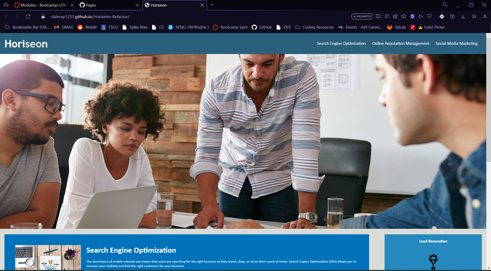

<!-- GIVEN I need to sample a potential employee's previous work
WHEN I load their portfolio
THEN I am presented with the developer's name, a recent photo or avatar, and links to sections about them, their work, and how to contact them
WHEN I click one of the links in the navigation
THEN the UI scrolls to the corresponding section
WHEN I click on the link to the section about their work
THEN the UI scrolls to a section with titled images of the developer's applications
WHEN I am presented with the developer's first application
THEN that application's image should be larger in size than the others
WHEN I click on the images of the applications
THEN I am taken to that deployed application
WHEN I resize the page or view the site on various screens and devices
THEN I am presented with a responsive layout that adapts to my viewport -->

<!-- Technical Acceptance Criteria: 40%
Satisfies all of the preceding acceptance criteria.
Deployment: 32%
Application deployed at live URL.

Application loads with no errors.

Application GitHub URL submitted.

GitHub repository contains application code.

Application Quality: 15%
Application resembles the mock-up functionality provided in the Challenge instructions.
Repository Quality: 13%
Repository has a unique name.

Repository follows best practices for file structure and naming conventions.

Repository follows best practices for class/id naming conventions, indentation, quality comments, etc.

Repository contains multiple descriptive commit messages.

Repository contains a quality readme with description, screenshot, link to deployed application. -->

# Horiseon

Welcome to the Horiseon website! This website provides information about online marketing services and strategies offered by Horiseon Social Solution Services, Inc.

## Description

Horiseon is a website that introduces you to the world of online marketing. The website highlights three key services: Search Engine Optimization (SEO), Online Reputation Management, and Social Media Marketing.

## Features

### Search Engine Optimization

Learn how to improve your website's search ranking and attract the right customers through effective SEO strategies.

### Online Reputation Management

Discover how Online Reputation Management can help you take control of what potential customers see when they search for your business.

### Social Media Marketing

Explore how Social Media Marketing can enhance brand awareness and lead generation by connecting with your target audience.

## Benefits

The Horiseon website emphasizes the following benefits:

- **Lead Generation:** Inbound strategies bring customers to your website, increasing your chances of converting them into clients.

- **Brand Awareness:** Improve your business's visibility and search ranking, helping potential customers discover your brand.

- **Cost Management:** As your search ranking improves, your advertising costs decrease, allowing you to manage your marketing budget.

## Contributing

Starter code source: https://github.com/coding-boot-camp/urban-octo-telegram

## Footer

Github Page: https://daleray1231.github.io/Horiseon-Refactor

The website is made with ❤️️ by Horiseon Social Solution Services, Inc.

&copy; 2023 Horiseon Social Solution Services, Inc.

## License

This project is licensed under the [MIT License](LICENSE).

